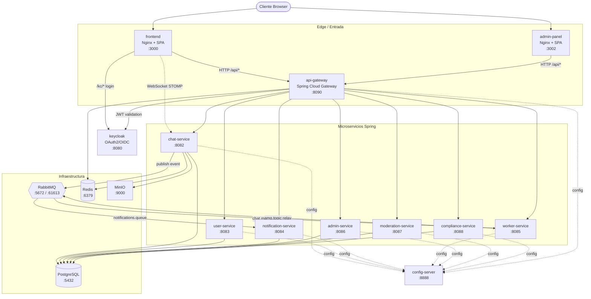
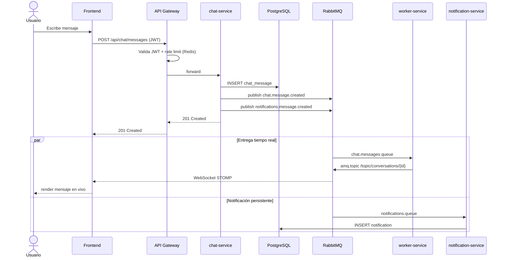

# SuperChat

Plataforma de chat corporativo con arquitectura de microservicios para demostración universitaria.

> **▶ Despliegue (Windows / Linux / macOS):** una sola orden — ver **[DEPLOY.md](DEPLOY.md)**.
> Windows: `.\deploy.ps1` · Linux/macOS: `./deploy.sh`

Documento de arquitectura para presentación:

- docs/ARQUITECTURA_SUPERCHAT.md

> **Edición Enterprise / Universitaria:** `docker compose up` levanta también los servicios `admin-service`, `moderation-service`, `compliance-service` y el `admin-panel`. El modelo multi-tenant, RBAC, reglas de negocio, moderación de contenido, cifrado de mensajes, cumplimiento GDPR y observabilidad están documentados en **[ENTERPRISE.md](ENTERPRISE.md)**.

## Stack

- Java 21 (Temurin)
- Spring Boot 3.5 / Spring Cloud 2025.0.2
- Spring Cloud Gateway (API Gateway + rate limiting)
- Spring Cloud Config Server
- Keycloak 26.6.1 (OAuth2/OIDC, emisión de JWT)
- RabbitMQ 4 (mensajería async + relay STOMP)
- PostgreSQL 16 (persistencia)
- Redis 7 (rate limiting y presencia)
- MinIO (almacenamiento de archivos adjuntos)
- Frontend HTML/CSS/JS con Nginx (chat SPA + admin-panel)
- Prometheus + Grafana (observabilidad)
- Dozzle (visor de logs de contenedores en tiempo real)
- Docker Compose

## Arquitectura



### Flujo de un mensaje en tiempo real



| Servicio | Puerto | Rol |
|---|---|---|
| `keycloak` | 8080 | Proveedor de identidad (OAuth2/OIDC, JWT) |
| `config-server` | 8888 | Spring Cloud Config Server |
| `api-gateway` | 8090 | Entrada única: validación JWT, rate limiting, routing |
| `chat-service` | 8082 | Mensajes, WebSocket STOMP, presencia |
| `user-service` | 8083 | Perfiles de usuario, salas |
| `notification-service` | 8084 | Notificaciones asíncronas |
| `worker-service` | 8085 | Consumidor RabbitMQ → relay STOMP/WebSocket, simulación de falla |
| `admin-service` | 8086 | Reglas de negocio por organización (ver [ENTERPRISE.md](ENTERPRISE.md)) |
| `moderation-service` | 8087 | Filtro de contenido/lenguaje + registro de incidentes |
| `compliance-service` | 8088 | Auditoría, consentimiento, exportación/borrado GDPR, retención |
| `frontend` | 3000 | Nginx + SPA (chat) |
| `admin-panel` | 3002 | Nginx + SPA (administración) |
| `rabbitmq` | 5672/61613/15672 | Broker de eventos + relay STOMP |
| `postgres` | 5432 | Bases de datos separadas por servicio |
| `redis` | 6379 | Rate limiting y presencia |
| `minio` | 9000/9001 | Almacenamiento de archivos adjuntos |
| `prometheus` | 9090 | Recolección de métricas |
| `grafana` | 3001 | Dashboards |
| `dozzle` | 9999 | Visor de logs de contenedores |
| `portainer` | 9080 | UI de administración de contenedores Docker |
| `redis-commander` | 8181 | UI web para inspeccionar claves de Redis (admin/admin) |

Flujo principal de mensaje en tiempo real:

1. Usuario inicia sesión en el frontend via Keycloak (ROPC).
2. Frontend llama a `POST /api/chat/messages` con JWT Bearer.
3. API Gateway valida el JWT, aplica rate limiting, enruta a chat-service.
4. chat-service guarda el mensaje en PostgreSQL.
5. chat-service publica evento en RabbitMQ (`chat.exchange` → `chat.messages.queue`).
6. worker-service consume la cola y retransmite al topic WebSocket `/topic/conversations/{id}` via `amq.topic`.
7. Simultáneamente chat-service publica en `notifications.exchange` → notification-service guarda la notificación.
8. Frontend recibe el evento en tiempo real via STOMP/WebSocket.

## Despliegue desde cero con un solo comando

SuperChat corre **100% en Docker**, así que se despliega igual en cualquier SO — el host sólo necesita **Docker** (ni Java, ni Maven, ni bases de datos por separado). La guía completa multiplataforma (requisitos de hardware, LAN, HTTPS, troubleshooting) está en **[DEPLOY.md](DEPLOY.md)**.

### Windows (Docker Desktop + PowerShell) — la vía más simple en Windows

**Requisitos:** [Docker Desktop](https://www.docker.com/products/docker-desktop/) (al instalarlo habilita el backend WSL2 automáticamente) y [Git para Windows](https://git-scm.com/download/win). No necesitas instalar Java, Maven ni configurar WSL a mano.

```powershell
# 1. Verificar que Docker está listo (en PowerShell)
docker version
docker compose version

# 2. Clonar y entrar al proyecto
git clone https://github.com/johansan1983/progdist.git
cd progdist

# 3. Levantar TODO el stack con una sola orden
.\deploy.ps1
```

Si PowerShell bloquea el script (*"No se puede cargar el archivo … la ejecución de scripts está deshabilitada en este sistema"*), ejecútalo sin cambiar la política del sistema:

```powershell
powershell -ExecutionPolicy Bypass -File .\deploy.ps1
```

o, alternativamente, habilita tus propios scripts locales **una sola vez** (no requiere administrador) y luego usa `.\deploy.ps1` normal:

```powershell
Set-ExecutionPolicy -Scope CurrentUser -ExecutionPolicy RemoteSigned
```

`deploy.ps1` es idempotente y hace todo de punta a punta: verifica que Docker esté corriendo, genera secretos (`AES_ENCRYPTION_KEY`, `INTERNAL_API_TOKEN`) en un `.env` privado **sólo en el primer arranque**, renderiza el realm de Keycloak para tu host, crea el volumen `rabbitmq_data`, compila las imágenes y levanta el stack. El primer build descarga dependencias y tarda varios minutos; Keycloak tarda **~90–120 s** en el primer arranque. Cuando termine, abre <http://localhost:3000>.

Para acceder desde otra máquina de la red local (que Keycloak emita los `redirectUris` con la IP correcta):

```powershell
.\deploy.ps1 -PublicHost 10.0.0.50
```

> **Nota WSL2/RAM:** Docker Desktop usa WSL2 por debajo. Si el stack va justo de memoria, crea `%USERPROFILE%\.wslconfig` con `[wsl2]` `memory=10GB` y reinicia con `wsl --shutdown`. Ver detalles en [DEPLOY.md](DEPLOY.md).

### Linux / WSL2 — desde cero sin nada preinstalado

Funciona en una WSL2 (Ubuntu/Debian) o un Linux apt-based recién creado **sin nada instalado** (ni `git`, ni `docker`, ni `make`).

#### Opción A — One-liner remoto (estilo Vercel)

Pega esto en cualquier WSL2 / VM Ubuntu/Debian limpia. No requiere ni siquiera `git` (sólo `curl`):

```bash
curl -fsSL https://raw.githubusercontent.com/johansan1983/progdist/main/scripts/install.sh | bash
```

Esto descarga `install.sh`, instala `curl`+`git`, clona el repo en `~/progdist` y lanza el bootstrap (que instala Docker y levanta el stack).

Variables opcionales:

```bash
# Cambiar el directorio destino
curl -fsSL https://raw.githubusercontent.com/johansan1983/progdist/main/scripts/install.sh | INSTALL_DIR=/opt/progdist bash

# Solo instalar deps + clonar, sin levantar el stack
curl -fsSL https://raw.githubusercontent.com/johansan1983/progdist/main/scripts/install.sh | NO_UP=1 bash
```

#### Opción B — Con `git` ya instalado

```bash
git clone https://github.com/johansan1983/progdist.git && cd progdist
make bootstrap
```

#### Opción C — Tarball sin `git`

```bash
curl -fsSL https://github.com/johansan1983/progdist/archive/refs/heads/main.tar.gz | tar -xz
cd progdist-main && bash scripts/bootstrap.sh
```

Si ni siquiera hay `curl`:
```bash
sudo apt-get update && sudo apt-get install -y curl
```

Alternativa one-shot vía SSH desde tu máquina (sin acceso al servidor por terminal):
```bash
# Copia el repo comprimido al servidor y ejecuta bootstrap
tar czf /tmp/progdist.tgz -C $(pwd)/.. progdist
scp /tmp/progdist.tgz user@server:/tmp/
ssh user@server 'cd /opt && sudo tar xzf /tmp/progdist.tgz && cd progdist && bash scripts/bootstrap.sh'
```

### Qué hace el bootstrap

`scripts/bootstrap.sh` hace todo de punta a punta de forma idempotente:

1. Detecta el SO y si está corriendo dentro de WSL2.
2. Instala dependencias del sistema (`curl`, `gpg`, **`git`**, `make`, `ca-certificates`).
3. Instala Docker Engine + Docker Compose v2 desde el repo oficial de Docker (si no estaban).
4. Arranca el daemon de Docker (systemd, `service` o `dockerd` directo según lo que aplique).
5. Agrega el usuario actual al grupo `docker`.
6. Crea el volumen externo `rabbitmq_data`.
7. Ejecuta `docker compose up -d --build` (compila los 9 servicios Spring y baja todas las imágenes).
8. Espera a que Keycloak esté listo (~90–120s en el primer arranque).
9. Imprime las URLs, credenciales y usuarios precargados.

Flags útiles:

```bash
bash scripts/bootstrap.sh --no-up           # solo instalar deps
bash scripts/bootstrap.sh --open-firewall   # abre puertos del stack en ufw si esta activo
```

> **WSL2 sin systemd:** si el daemon no arranca, habilita systemd creando `/etc/wsl.conf` con
> ```ini
> [boot]
> systemd=true
> ```
> y luego desde Windows: `wsl --shutdown`. El script lo detecta y te avisa si falta.

### Caveats validados en testing real

Probamos el despliegue desde una WSL2 limpia tanto de Ubuntu 24.04 como de Debian 13 (Trixie). Lo que aprendimos:

**Debian 13 minimal viene sin `curl`.** El one-liner remoto necesita `curl`. Si la WSL es Debian recién instalada, instálalo primero:
```bash
sudo apt-get update && sudo apt-get install -y curl
```
Ubuntu 24.04 sí trae `curl` por defecto.

**DNS intermitente en WSL Debian con `containerd`.** El resolver por defecto (`10.255.255.254`) a veces falla en UDP/IPv4 para `containerd` al descargar layers de Docker Hub / Cloudflare, mientras que `getent hosts` funciona vía IPv6. Síntoma típico:
```
failed to copy: ... lookup production.cloudflare.docker.com on 10.255.255.254:53: read udp ... i/o timeout
```
Fix puntual (añade DNS público a la WSL Debian):
```bash
sudo rm /etc/resolv.conf
sudo tee /etc/resolv.conf <<EOF
nameserver 1.1.1.1
nameserver 8.8.8.8
nameserver 10.255.255.254
EOF
sudo chattr +i /etc/resolv.conf  # evita regeneración
sudo systemctl restart docker
```
Ubuntu 24.04 en WSL no presentó este problema en nuestras pruebas.

**RAM total.** El stack pide ~6-8 GB de RAM. WSL2 toma por defecto ~50% del host. Si vas justo, define en `%USERPROFILE%\.wslconfig`:
```ini
[wsl2]
memory=10GB
processors=4
```
y reinicia con `wsl --shutdown`.

## Configuración por entorno (.env)

Para escenarios donde el stack se accede desde fuera del host (otra máquina en la red, internet) hay que parametrizar el hostname público. Copia el ejemplo:

```bash
cp .env.example .env
```

Variables disponibles:

| Variable | Default | Uso |
|---|---|---|
| `PUBLIC_HOST` | `localhost` | IP o hostname para acceso plano por HTTP. Se inyecta en `KC_HOSTNAME` y en los `redirectUris` del realm de Keycloak |
| `PUBLIC_DOMAIN` | `localhost` | Dominio público (con DNS apuntando a la VM) para el perfil productivo con HTTPS via Caddy |
| `ACME_EMAIL` | *(vacío)* | Email para Let's Encrypt — recibe avisos de expiración |

El script `scripts/render-realm.sh` (también ejecutable con `make render-realm`) regenera `keycloak/superchat-realm.json` desde su template aplicando estas variables. `make up` y `make bootstrap` ya lo invocan automáticamente.

### Ejemplo: VM local accedida desde otra máquina

```bash
echo "PUBLIC_HOST=10.0.0.50" > .env
make up
# Login con alice/demo123 desde http://10.0.0.50:3000 funciona porque
# el realm ahora acepta redirectUris con 10.0.0.50.
```

## Despliegue productivo con HTTPS (Caddy + Let's Encrypt)

`docker-compose.prod.yml` añade un Caddy al frente que:
- Termina TLS y obtiene certificados de Let's Encrypt automáticamente
- Hace reverse proxy al nginx del frontend (que ya enruta `/api`, `/kc`, `/ws` internamente)
- Deja `Caddy` como **único** servicio con puertos expuestos al host (80/443) — el resto queda accesible sólo dentro de la red Docker

### Pasos

1. Apuntar el dominio (DNS A o AAAA) a la IP pública de la VM.
2. Configurar `.env`:
   ```bash
   cp .env.example .env
   # Editar:
   #   PUBLIC_DOMAIN=chat.example.com
   #   ACME_EMAIL=tu@correo.com
   ```
3. Abrir 80/443 en firewall (proveedor cloud y `ufw`).
4. Levantar:
   ```bash
   make up-prod
   # equivalente a:
   # docker compose -f docker-compose.yml -f docker-compose.prod.yml up -d --build
   ```
5. Caddy obtiene el cert TLS automáticamente en el primer hit (puede tardar 10-30s la primera vez).

Después, el frontend está en `https://chat.example.com` con HTTPS automáticamente renovado. Las herramientas administrativas (Portainer, Dozzle, Grafana, Prometheus, RabbitMQ Management) siguen bindeadas a sus puertos por separado — recomendado **no** exponerlas públicamente y acceder via SSH tunnel:

```bash
ssh -L 9080:localhost:9080 -L 9999:localhost:9999 -L 3001:localhost:3001 user@chat.example.com
```

Para bajar el perfil productivo:
```bash
make down-prod
```

---

## Instalación de dependencias (Linux / WSL2)

### Docker Engine + Docker Compose V2

Todo el stack corre en contenedores. Docker es el único requisito obligatorio para levantar el proyecto.

```bash
# 1. Instalar dependencias del sistema
sudo apt-get update
sudo apt-get install -y ca-certificates curl gnupg lsb-release

# 2. Agregar el repositorio oficial de Docker
sudo install -m 0755 -d /etc/apt/keyrings
curl -fsSL https://download.docker.com/linux/ubuntu/gpg \
  | sudo gpg --dearmor -o /etc/apt/keyrings/docker.gpg
sudo chmod a+r /etc/apt/keyrings/docker.gpg

echo "deb [arch=$(dpkg --print-architecture) signed-by=/etc/apt/keyrings/docker.gpg] \
  https://download.docker.com/linux/ubuntu $(lsb_release -cs) stable" \
  | sudo tee /etc/apt/sources.list.d/docker.list > /dev/null

# 3. Instalar Docker Engine y el plugin Compose
sudo apt-get update
sudo apt-get install -y docker-ce docker-ce-cli containerd.io docker-buildx-plugin docker-compose-plugin

# 4. Permitir ejecutar Docker sin sudo (requiere cerrar y reabrir sesión)
sudo usermod -aG docker $USER

# 5. Verificar instalación
docker --version
docker compose version
```

> En WSL2, después del `usermod` cierra y vuelve a abrir la terminal (o ejecuta `newgrp docker`).

### Java 21 y Maven (solo para desarrollo local)

Solo necesario si quieres compilar o ejecutar tests de un servicio fuera de Docker. El `docker compose up --build` compila todo internamente.

```bash
# Java 21 (Temurin) via SDKMAN — recomendado
curl -s "https://get.sdkman.io" | bash
source "$HOME/.sdkman/bin/sdkman-init.sh"
sdk install java 21.0.7-tem
sdk install maven 3.9.9

# Verificar
java -version
mvn -version
```

Alternativa sin SDKMAN:

```bash
sudo apt-get install -y maven
# Nota: el Maven de apt puede traer OpenJDK en lugar de Temurin.
# Para Temurin: https://adoptium.net/installation/linux/
```

---

## Levantar el proyecto

Requisitos previos:

```bash
# Verificar Docker Compose V2
docker compose version

# Crear volumen externo de RabbitMQ (solo la primera vez)
docker volume create rabbitmq_data
```

> **Nota:** Si actualizas desde una versión anterior elimina el volumen de Postgres:
> `docker volume rm progdist_postgres_data`

Levantar todo:

```bash
docker compose up -d --build
```

Keycloak tarda 90–120 segundos en el primer arranque.

### Usuarios de prueba precargados

El realm `superchat` se importa automáticamente al primer arranque con 6 usuarios ya listos para usar (todos con password `demo123`):

| Username | Email | Password |
|---|---|---|
| `alice` | alice@superchat.local | `demo123` |
| `bob` | bob@superchat.local | `demo123` |
| `charlie` | charlie@superchat.local | `demo123` |
| `dave` | dave@superchat.local | `demo123` |
| `eve` | eve@superchat.local | `demo123` |
| `frank` | frank@superchat.local | `demo123` |

Estos usuarios están definidos en `keycloak/superchat-realm.json` y se importan vía el flag `--import-realm` del comando de Keycloak.

> **Nota:** Keycloak sólo importa el realm si todavía no existe en su base de datos. Si ya levantaste el stack antes de que el realm tuviera usuarios, ejecuta `make reseed-keycloak` para reimportar (esto recrea la BD de Keycloak; **no** afecta los datos de chat, perfiles ni notificaciones).

Si necesitas agregar usuarios extra a mano: Keycloak Admin Console (`http://localhost:8080`, admin/admin → realm `superchat` → Users → Add user).

Validar estado:

```bash
docker compose ps
```

## URLs

| URL | Descripción | Credenciales |
|---|---|---|
| http://localhost:3000 | Frontend SPA | (usuarios Keycloak) |
| http://localhost:3002 | Admin Panel SPA | (usuarios Keycloak con rol admin) |
| http://localhost:8080 | Keycloak Admin | admin / admin |
| http://localhost:8090 | API Gateway | — |
| http://localhost:8888 | Config Server | — |
| http://localhost:15672 | RabbitMQ Management | superchat / superchat123 |
| http://localhost:9000 | MinIO API | superchat / superchat123 |
| http://localhost:9001 | MinIO Console | superchat / superchat123 |
| http://localhost:9090 | Prometheus | — |
| http://localhost:3001 | Grafana | admin / admin |
| http://localhost:9999 | Dozzle (logs) | — |
| http://localhost:9080 | Portainer | (crear admin en el primer acceso) |
| http://localhost:8181 | Redis Commander | admin / admin |
| http://localhost:8082/docs | Chat Swagger | — |
| http://localhost:8083/docs | User Swagger | — |
| http://localhost:8084/docs | Notification Swagger | — |
| http://localhost:8085/docs | Worker Swagger | — |
| http://localhost:8086/docs | Admin Service Swagger | — |
| http://localhost:8087/docs | Moderation Service Swagger | — |
| http://localhost:8088/docs | Compliance Service Swagger | — |

## CI/CD con GitHub Actions

El repo trae dos workflows en `.github/workflows/`:

| Workflow | Trigger | Qué hace |
|---|---|---|
| `ci.yml` | push/PR a `main` | Compila y testea (`mvn -B verify`) los 9 servicios Spring en paralelo (matrix: config-server, api-gateway, chat, user, notification, worker, admin, moderation, compliance) y valida que `docker-compose.yml` + `docker-compose.prod.yml` sean sintácticamente correctos |
| `docker-publish.yml` | push a `main` y tags `v*` | Construye las 11 imágenes Docker (9 Spring + frontend + admin-panel) con Buildx y las publica a **GitHub Container Registry** (`ghcr.io/johansan1983/progdist-<servicio>`). Caché de capas vía GHA cache |

Las imágenes publicadas quedan accesibles en `https://github.com/johansan1983/progdist/pkgs/container/...` y se pueden tirar directamente sin construir local:

```bash
docker pull ghcr.io/johansan1983/progdist-chat-service:latest
```

Tags generados por cada push a `main`:
- `latest` (siempre apunta al último build de main)
- `main`
- `<sha-corto>` (ej. `a1b2c3d`)

Para versiones, basta crear un tag git `v1.0.0` y se publica también con tag semver.

## Troubleshooting rápido

Si `chat-service`, `worker-service` o `notification-service` están en `Restarting`:

```bash
docker compose logs --tail=50 chat-service
docker compose logs --tail=50 notification-service
```

También puedes ver los logs en tiempo real desde Dozzle en http://localhost:9999.

Causas frecuentes:
- RabbitMQ sin el usuario `superchat` (ocurre si el volumen ya existía con otro usuario). Solución:
  ```bash
  curl -u guest:guest -X PUT http://localhost:15672/api/users/superchat \
    -H "Content-Type: application/json" \
    -d '{"password":"superchat123","tags":"administrator"}'
  curl -u guest:guest -X PUT "http://localhost:15672/api/permissions/%2F/superchat" \
    -H "Content-Type: application/json" \
    -d '{"configure":".*","write":".*","read":".*"}'
  docker compose restart chat-service worker-service notification-service
  ```
- chat-service o worker-service en 502 via gateway: esperar a que estén `healthy` o revisar migración Flyway.

## Endpoints

Todos los endpoints de negocio pasan por el API Gateway en `http://localhost:8090/api/`.

**Chat:**

- `GET  /api/chat/conversations/{id}/messages`
- `POST /api/chat/conversations`
- `POST /api/chat/messages`
- `POST /api/chat/attachments/presign` — genera URL prefirmada para subir archivos a MinIO
- `GET  /api/chat/presence`

**Worker:**

- `GET  /api/worker/simulation/realtime-publisher/status`
- `POST /api/worker/simulation/realtime-publisher/fail`
- `POST /api/worker/simulation/realtime-publisher/restore`

**Usuarios:**

- `GET  /api/users/me` — devuelve (y auto-crea) el perfil del usuario autenticado
- `PUT  /api/users/me` — actualiza el perfil
- `GET  /api/users/{id}` — perfil de otro usuario
- `GET  /api/users/search` — búsqueda de usuarios

**Salas:**

- `POST /api/rooms` — crear sala
- `GET  /api/rooms` — listar salas
- `GET  /api/rooms/{id}/members` — listar miembros
- `POST /api/rooms/{id}/members` — agregar miembro

**Notificaciones:**

- `GET /api/notifications`
- `GET /api/notifications/unread-count`
- `PUT /api/notifications/{id}/read`

**WebSocket/STOMP:**

- Endpoint SockJS: `/ws` (va directo a chat-service, bypass del gateway)
- Topic mensajes: `/topic/conversations/{conversationId}`
- Topic typing: `/topic/conversations/{conversationId}/typing`
- App destination typing: `/app/typing`

## Ejemplo rápido con curl

Obtener token desde Keycloak (requiere usuario creado en el realm `superchat`):

```bash
TOKEN=$(curl -sS -X POST http://localhost:8080/realms/superchat/protocol/openid-connect/token \
  -H 'Content-Type: application/x-www-form-urlencoded' \
  -d 'client_id=superchat-frontend&username=alice&password=demo123&grant_type=password' \
  | python3 -c "import sys,json; print(json.load(sys.stdin)['access_token'])")
```

Crear conversación:

```bash
curl -sS -X POST http://localhost:8090/api/chat/conversations \
  -H "Authorization: Bearer $TOKEN" \
  -H 'Content-Type: application/json' \
  -d '{"name":"General"}'
```

Enviar mensaje:

```bash
curl -sS -X POST http://localhost:8090/api/chat/messages \
  -H "Authorization: Bearer $TOKEN" \
  -H 'Content-Type: application/json' \
  -d '{"conversationId":1,"content":"Hola mundo"}'
```

Listar mensajes:

```bash
curl -sS http://localhost:8090/api/chat/conversations/1/messages \
  -H "Authorization: Bearer $TOKEN"
```

Perfil de usuario (se auto-crea en el primer acceso):

```bash
curl -sS http://localhost:8090/api/users/me \
  -H "Authorization: Bearer $TOKEN"
```

Consultar presencia:

```bash
curl -sS http://localhost:8090/api/chat/presence \
  -H "Authorization: Bearer $TOKEN"
```

Notificaciones pendientes:

```bash
curl -sS http://localhost:8090/api/notifications/unread-count \
  -H "Authorization: Bearer $TOKEN"
```

Simular falla del publicador en tiempo real:

```bash
curl -sS -X POST http://localhost:8090/api/worker/simulation/realtime-publisher/fail \
  -H "Authorization: Bearer $TOKEN"
```

Restablecer publicador:

```bash
curl -sS -X POST http://localhost:8090/api/worker/simulation/realtime-publisher/restore \
  -H "Authorization: Bearer $TOKEN"
```

## Verificación de eventos RabbitMQ

```bash
curl -u superchat:superchat123 http://localhost:15672/api/queues/%2F/chat.messages.queue
```

Revisa los campos `messages` (pendientes) y `message_stats.publish` (total publicados).

## Funcionalidades UI implementadas

- Sesión persistente en navegador (auto-refresh de token Keycloak).
- Botón de cerrar sesión.
- Indicador de "escribiendo..." en tiempo real.
- Scroll fijo del chat con posición inicial en el último mensaje.
- Sidebar derecho con cantidad de usuarios conectados y sus nombres.
- Envío de archivos adjuntos (imágenes, audio, documentos) via MinIO presigned URLs.
- Mensajes de voz grabados directamente desde el navegador.
- Mensajes de un solo uso (view-once): se auto-eliminan 5 segundos después de ser leídos.
- Lightbox de imágenes al hacer clic.
- Envío de mensaje con Enter.
- Selector de emojis.

## Identidad JWT

El identificador canónico de usuario en todos los servicios es el claim `sub` del JWT de Keycloak (UUID). El claim `preferred_username` lleva el nombre visible. Cada servicio valida JWTs contra el endpoint JWKS de Keycloak (`/realms/superchat/protocol/openid-connect/certs`).

## Observabilidad

- **Prometheus** (`:9090`) raspa métricas JVM y de negocio de los 8 servicios Spring (api-gateway, chat, user, notification, worker, admin, moderation, compliance) via `/actuator/prometheus`.
- **Grafana** (`:3001`) provee dashboards auto-provisionados (datasource Prometheus + dashboard "SuperChat Enterprise").
- **Dozzle** (`:9999`) permite ver y filtrar logs de todos los contenedores en tiempo real desde el navegador, sin necesidad de acceso a la terminal.
- **Portainer** (`:9080`) UI web para administrar contenedores: ver estado, reiniciar, ver logs, consola, inspeccionar redes y volúmenes. En el primer acceso pide crear usuario admin.
- Cada servicio incluye un `CorrelationIdFilter` que propaga el header `X-Request-ID` en todos los logs (también a través de RabbitMQ, ver sección siguiente).

## Trazabilidad: X-Request-ID end-to-end

Todos los servicios propagan un mismo `X-Request-ID` a lo largo de toda la cadena para poder correlacionar logs entre contenedores en Dozzle.

```
Cliente HTTP ──► API Gateway ──► chat-service ──► RabbitMQ ──► worker-service / notification-service
                  (genera ID)     (lee header)    (header AMQP)   (lee header → MDC)
```

| Componente | Mecanismo |
|---|---|
| `api-gateway` | `CorrelationIdFilter` reactive: si la petición no trae `X-Request-ID`, genera uno; lo añade al request mutado (forward downstream) y al response. `MdcContextLifterConfig` mantiene el ID en MDC a través de cambios de hilo reactivos |
| `chat-service`, `user-service`, `notification-service`, `worker-service` | `CorrelationIdFilter` servlet: lee `X-Request-ID` del request y lo guarda en `MDC` durante el ciclo |
| `chat-service` → RabbitMQ | `RabbitTemplate` con `addBeforePublishPostProcessors` lee `MDC.get("requestId")` y lo escribe como header `X-Request-ID` en el mensaje AMQP |
| RabbitMQ → `worker-service` / `notification-service` | Los `@RabbitListener` reciben `@Header("X-Request-ID")` y lo restauran en `MDC` |
| Logs | Patrón Logback `%X{requestId:----}` imprime el ID en cada línea → visible y filtrable desde Dozzle |

Probar en vivo:

```bash
curl -i http://localhost:8090/api/chat/presence \
  -H "Authorization: Bearer $TOKEN" \
  -H "X-Request-ID: demo-1234"
# La respuesta incluye X-Request-ID: demo-1234
# En Dozzle (http://localhost:9999) filtra por "demo-1234" y verás los logs
# de api-gateway, chat-service y, al enviar un mensaje, también de
# worker-service / notification-service con el mismo ID.
```

## Manejo del stack con Makefile

El `Makefile` envuelve los comandos de `docker compose` para facilitar el día a día:

```bash
make help          # listar todos los targets
make up            # levantar todo (compila si hace falta)
make down          # detener y eliminar contenedores
make ps            # estado de los contenedores
make logs          # logs en vivo de todo el stack
make logs-chat-service   # logs en vivo de un servicio específico
make restart-worker-service
make health        # GET /actuator/health de los servicios Spring
make urls          # imprimir las URLs útiles
make clean         # bajar y borrar volúmenes locales
```

## ¿Qué pasa si un contenedor falla?

| Cae | Efecto inmediato | Recuperación |
|---|---|---|
| `worker-service` | Los mensajes se acumulan en `chat.messages.queue` (RabbitMQ los persiste). El frontend deja de recibir el mensaje en tiempo real vía WebSocket, pero el mensaje ya fue persistido en Postgres por chat-service. Al reiniciar el worker, consume el backlog y se entrega el mensaje al topic STOMP | `make restart-worker-service` o reiniciar desde Portainer |
| `notification-service` | Los eventos se acumulan en `notifications.queue`. No se generan notificaciones nuevas, pero los mensajes de chat siguen funcionando. Al reiniciar consume el backlog | `make restart-notification-service` |
| `chat-service` | El gateway responde 502/503 en `/api/chat/**`. WebSocket directos a `/ws` se caen. Frontend muestra error al enviar mensaje | Auto-restart por `restart: always` |
| `rabbitmq` | chat-service no puede publicar (los envíos fallan). worker/notification se quedan sin consumir. WebSocket STOMP relay se desconecta | Auto-restart; cola y mensajes durables se conservan en el volumen `rabbitmq_data` |
| `postgres` | Spring services entran en estado de error/restart. Datos persistidos en volumen `postgres_data` | Auto-restart; al volver, los servicios reconectan |
| `redis` | Rate limiting del gateway falla (se pierde estado). Presencia se reinicia | Auto-restart |
| `keycloak` | Login deja de funcionar; sesiones con JWT vigente siguen operando hasta que caduque el token | Auto-restart (90–120s) |
| `config-server` | Servicios ya levantados siguen con su config cacheada. Servicios que aún no arrancan no podrán hacerlo | Auto-restart |
| `api-gateway` | Frontend pierde el único punto de entrada `/api/*`. WebSocket `/ws` (que va directo a chat-service) sigue funcionando | Auto-restart |
| `frontend` (nginx) | La SPA deja de servirse. Backend sigue OK; APIs accesibles directamente vía 8090 | Auto-restart |
| `prometheus` / `grafana` / `dozzle` / `portainer` | Solo afecta observabilidad/administración. Negocio intacto | Auto-restart |

Patrón general: todos los servicios tienen `restart: always` + healthchecks; las dependencias usan `depends_on: condition: service_healthy` para arrancar en orden; las colas RabbitMQ son `durable` y el volumen `rabbitmq_data` es externo para sobrevivir a `docker compose down`.

## Redes Docker

El `docker-compose.yml` separa el tráfico en tres redes bridge:

- **`frontend-net`** — sólo `frontend`, `api-gateway`, `chat-service` (para WebSocket directo) y `keycloak` (para token endpoint vía `/kc/*`).
- **`backend-net`** — bus de comunicación entre microservicios e infraestructura (RabbitMQ, Redis, Config Server, MinIO, Prometheus, Grafana, Dozzle, Portainer).
- **`db-net`** — sólo `postgres` y los servicios que consultan base de datos (`chat-service`, `user-service`, `notification-service`, `keycloak`).

El `worker-service` y `notification-service` no necesitan acceso a internet ni a la red de frontend: sólo escuchan en `backend-net`. Esto reduce la superficie de ataque y deja claro qué servicios pueden hablarse.
