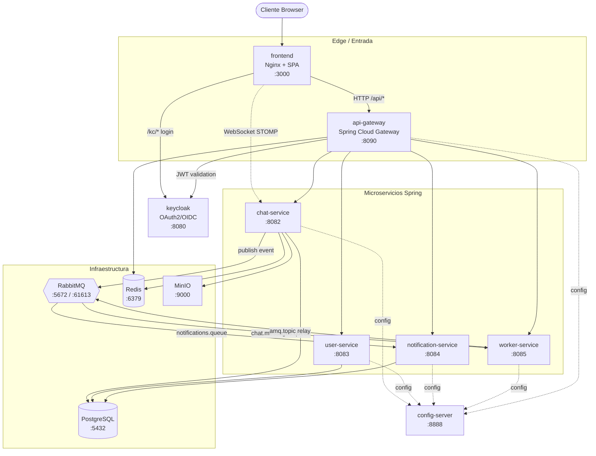

# Documento de Arquitectura - SuperChat MVP

## 1. Objetivo del documento

Este documento describe la arquitectura actual de SuperChat MVP y sirve como base para:

- Presentacion tecnica y ejecutiva del proyecto.
- Justificacion de decisiones de diseno.
- Explicacion de flujos de negocio y tiempo real.
- Identificacion de limites, riesgos y siguientes pasos.

---

## 2. Resumen ejecutivo

SuperChat es una aplicacion de chat en tiempo real basada en microservicios. El sistema separa responsabilidades en autenticacion, mensajeria y experiencia de usuario web.

La arquitectura combina:

- API REST para operaciones de negocio (login, conversaciones, mensajes, presencia, simulacion).
- Mensajeria asincrona con RabbitMQ para desacoplar escritura y entrega en tiempo real.
- WebSocket/STOMP para actualizaciones inmediatas en clientes conectados.
- Persistencia en PostgreSQL para historial de mensajes y conversaciones.

Valor tecnico principal:

- Se puede simular caida del publicador en tiempo real sin perder mensajes, porque RabbitMQ conserva eventos en cola y se procesan al restaurar el consumidor.

---

## 3. Alcance del MVP

Incluye:

- Login y validacion de token JWT.
- Creacion de conversacion (General).
- Envio y consulta historica de mensajes.
- Entrega en tiempo real via WebSocket.
- Indicador de "escribiendo".
- Vista de usuarios conectados (presencia).
- Simulacion de falla/restauracion del publicador realtime.
- Documentacion OpenAPI/Swagger.

No incluye (aun):

- Registro real de usuarios y password hashing persistente.
- Permisos por sala/rol.
- API Gateway dedicado.
- Presencia distribuida entre replicas (actualmente in-memory en chat-service).
- Pipeline de negocio adicional sobre eventos (analytics, auditoria, notificaciones externas).

---

## 4. Arquitectura logica

### 4.1 Componentes

1. frontend
- SPA ligera (HTML/CSS/JS) servida por Nginx.
- Gestiona login, chat en vivo, typing, presencia y simulacion de falla.
- Consume /auth/* y /chat/* via proxy.

2. auth-service
- Genera y valida JWT.
- Endpoints:
  - POST /auth/login
  - GET /auth/validate

3. chat-service
- API de conversaciones y mensajes.
- Publica eventos a RabbitMQ.
- Consume eventos Rabbit y los emite por WebSocket.
- Gestiona presencia y typing.
- Endpoints clave:
  - POST /chat/conversations
  - POST /chat/messages
  - GET /chat/conversations/{id}/messages
  - GET /chat/presence
  - GET/POST /chat/simulation/realtime-publisher/*
- STOMP:
  - /ws
  - /topic/conversations/{id}
  - /topic/conversations/{id}/typing
  - /app/typing

4. rabbitmq
- Broker de eventos.
- Cola de mensajes de chat.
- Permite desacople y resiliencia temporal.

5. postgres
- Persistencia de conversaciones y mensajes.

6. redis
- Disponible en infraestructura para evolucionar presencia/cache (actualmente no critico en el flujo).

### 4.2 Diagrama de contexto

> **Nota:** SuperChat evolucionó desde el MVP descrito arriba. La arquitectura
> actual sustituye `auth-service` por **Keycloak** (OAuth2/OIDC), añade
> **api-gateway**, **user-service**, **notification-service**, **worker-service**,
> **config-server** y **MinIO**, y promueve Redis a componente activo (rate
> limiting + presencia). El diagrama y el README reflejan ese estado.

---

## 5. Arquitectura de despliegue

Contenedores Docker Compose:

- frontend:80 -> host 3000
- auth-service:8081 -> host 8081
- chat-service:8082 -> host 8082
- rabbitmq:5672 y 15672
- postgres:5432
- redis:6379

Consideraciones de despliegue MVP:

- Todos los servicios en una misma red Docker local.
- Dependencias con healthcheck para arranque ordenado (rabbitmq/postgres).
- Volumen persistente para RabbitMQ y PostgreSQL.

---

## 6. Flujos principales

### 6.1 Flujo de autenticacion

1. Frontend envia credenciales a /auth/login.
2. auth-service devuelve JWT.
3. Frontend guarda sesion en localStorage.
4. Frontend valida sesion con /auth/validate al restaurar pagina.

### 6.2 Flujo de envio de mensaje (write path)

1. Cliente llama POST /chat/messages con token.
2. chat-service valida token (via auth-service).
3. chat-service persiste mensaje en PostgreSQL.
4. chat-service publica evento CHAT_MESSAGE_CREATED en RabbitMQ.
5. API responde al cliente con estado persisted_and_published.

### 6.3 Flujo de entrega realtime (read/live path)

1. Consumidor Rabbit de chat-service lee evento de cola.
2. chat-service emite evento al topic /topic/conversations/{id}.
3. Clientes suscritos renderizan el mensaje en tiempo real.

### 6.4 Flujo de typing

1. Cliente publica evento STOMP a /app/typing.
2. chat-service retransmite a /topic/conversations/{id}/typing.
3. Clientes muestran/ocultan indicador "esta escribiendo".

### 6.5 Flujo de presencia

1. Cliente abre sesion STOMP enviando username en headers.
2. Interceptor de canal registra connect/disconnect en PresenceService.
3. Frontend consulta /chat/presence cada pocos segundos.
4. Sidebar derecho muestra cantidad y listado de usuarios conectados.

### 6.6 Flujo de simulacion de falla

1. Operador ejecuta POST /chat/simulation/realtime-publisher/fail.
2. Se detiene el listener Rabbit de publicacion realtime.
3. Mensajes nuevos se acumulan en cola Rabbit.
4. Operador ejecuta POST /chat/simulation/realtime-publisher/restore.
5. Listener reanuda consumo y drena backlog en cola.

---

## 7. Decisiones de arquitectura y racional

1. Microservicios separados (auth/chat)
- Facilita separar dominios y responsabilidades.
- Permite evolucion independiente por servicio.

2. RabbitMQ entre persistencia y push realtime
- Evita acoplar escritura de mensajes con broadcasting WebSocket.
- Habilita tolerancia a fallas transitorias del publicador realtime.

3. WebSocket con STOMP/SockJS
- Protocolo simple para subscribe/publish en frontend web.
- Compatible con reconexion y topicos por conversacion.

4. Presencia en memoria
- Implementacion rapida para MVP.
- Costo: no escala horizontalmente sin estado compartido.

5. Simulacion de falla integrada
- Mejora demostrabilidad academica/tecnica.
- Permite evidenciar comportamiento eventual y cola durable.

---

## 8. Calidad del sistema (NFR)

### 8.1 Disponibilidad

- Si falla solo el publicador realtime (listener), no se pierde mensaje: queda en RabbitMQ.
- Si cae chat-service completo, la durabilidad depende de DB y cola (eventos ya publicados).

### 8.2 Consistencia

- Modelo "persist then publish": primero DB, luego evento.
- Entrega a UI eventual via cola.

### 8.3 Escalabilidad

- Escalable en lectura de topics con broker simple de Spring (limitado).
- Evolucion recomendada: broker externo STOMP o pub/sub dedicado + presencia en Redis.

### 8.4 Seguridad

- JWT firmado y validado por auth-service.
- Endpoints de chat protegidos por validacion de token.
- Falta hardening de identidad de usuario real para produccion.

---

## 9. Observabilidad y operacion

Monitoreo actual:

- Actuator health/info en auth y chat.
- RabbitMQ management UI para estado de colas.
- Logs de contenedores por docker compose logs.

Mejoras sugeridas:

- Trazabilidad distribuida (OpenTelemetry).
- Dashboards de metrica (Prometheus + Grafana).
- Alertas sobre backlog de cola y reconexiones websocket.

---

## 10. Riesgos tecnicos actuales

1. Presencia no distribuida
- Riesgo: datos inconsistentes en multiples replicas de chat-service.

2. Sin API Gateway
- Riesgo: politicas de seguridad/rate limit dispersas.

3. Auth simplificada
- Riesgo: no apto para produccion en gestion de usuarios reales.

4. Entrega realtime dependiente de un listener
- Mitigado por cola, pero requiere estrategia de reintentos y monitoreo robusto.

---

## 11. Roadmap tecnico recomendado

Corto plazo:

- Externalizar presencia a Redis.
- Definir contrato de eventos versionado.
- Agregar pruebas automatizadas de integracion (REST + Rabbit + WebSocket).

Mediano plazo:

- API Gateway con auth centralizada y rate limiting.
- Registro/usuarios reales con password hash.
- Pipeline de eventos para notificaciones y auditoria.

Largo plazo:

- Escalamiento horizontal de chat-service con estado compartido.
- Observabilidad completa y SLO definidos.
- Estrategia multi-tenant y permisos por sala.

---

## 12. Guion sugerido para presentacion (10-15 slides)

1. Problema y objetivo
2. Vision general de la solucion
3. Arquitectura de componentes
4. Flujo de autenticacion
5. Flujo de mensaje realtime (DB + Rabbit + WebSocket)
6. Presencia y typing
7. Simulacion de falla y recuperacion
8. Demo de Swagger/OpenAPI
9. NFR: resiliencia, consistencia, seguridad
10. Riesgos y trade-offs
11. Roadmap
12. Cierre y preguntas

---

## 13. Anexo rapido de URLs para demo

- Frontend: http://localhost:3000
- Auth Swagger UI: http://localhost:3000/auth/docs
- Chat Swagger UI: http://localhost:3000/chat/docs
- RabbitMQ UI: http://localhost:15672
- Auth health: http://localhost:8081/actuator/health
- Chat health: http://localhost:8082/actuator/health
